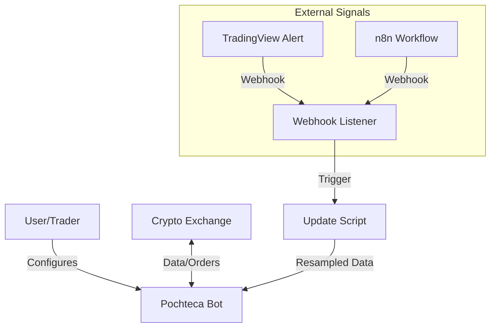

# Architecture Overview

## System Context
The core of **Pochteca** is the Freqtrade bot, augmented by an external orchestration layer (n8n/Webhooks) and a robust data pipeline.

## Component Description

### 1. Pochteca Bot (Freqtrade)
- **Role**: Core trading engine.
- **Responsibility**: Market analysis, signal generation, order execution, and position management.
- **Strategies**: Located in `user_data/strategies`, these python classes define the entry/exit logic.

### 2. Webhook Listener
- **Role**: Ingress adapter.
- **Responsibility**: Listens for POST requests from external signal providers, parses the payload, and triggers local actions (e.g., data updates or emergency stops).

### 3. Data Pipeline
- **Role**: Data freshness.
- **Responsibility**: The `updatedata.sh` script serves as a wrapper to fetch the latest OHLCV data from the exchange, ensuring strategies have the most recent candles for backtesting or live dry-run validation.
